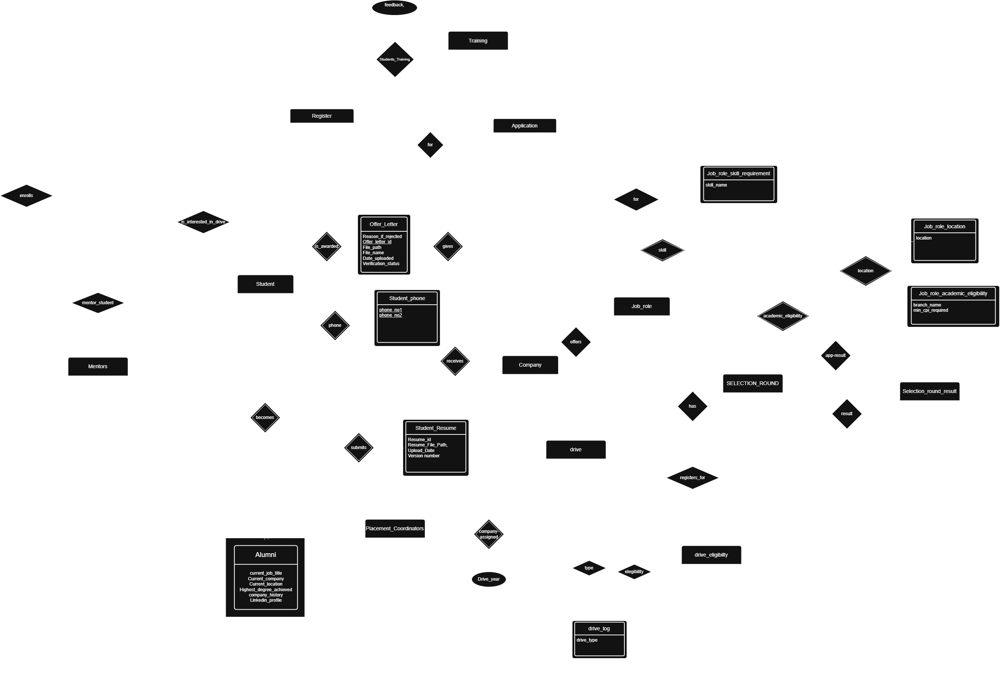

# 🎓 Placement Management System

A fully normalized **PostgreSQL database system** for managing end-to-end campus placement operations — student registrations, company drives, job applications, multi-round selection tracking, offer letters, mentorship, and training programs.

This project focuses on **database design excellence**: 23 BCNF-normalized tables, business-logic-enforcing triggers, reusable functions & stored procedures, and 31 analytical queries ranging from basic filters to window-function-powered rankings.


---

## 📖 Overview

Campus placement drives involve a lot of moving parts — students, companies, job roles, multi-round interviews, eligibility rules, resumes, offer letters, coordinators, mentors, and training sessions. This project models the *entire* workflow as a relational database, built to eliminate redundancy, enforce data integrity automatically, and answer real placement-office questions (placement rate by branch, top-paying companies, skill-gap analysis, etc.) with pure SQL.

It was designed and documented following a full DBMS engineering process: requirements → ER modeling → normalization → schema → business logic (triggers/procedures) → analytical querying.

## 📂 Repository Structure

```
Placement-Management-System/
├── docs/
│   ├── SRS Document.pdf         # Software Requirements Specification
│   ├── ER_diagram.png           # Entity-Relationship diagram
│   └── normalization_notes.md   # BCNF justification, table-by-table
├── sql/
│   ├── 01_schema.sql                     # DDL — all 23 tables, keys, constraints
│   ├── 02_triggers.sql                   # Automated business-rule enforcement
│   ├── 03_functions_and_procedures.sql   # Reusable PL/pgSQL logic
│   ├── 04_queries.sql                    # 31 analytical queries (basic → advanced)
│   └── 05_Insert statements.txt          # Sample seed data
└── README.md
```

## 🗺️ Entity-Relationship Diagram

<p align="center">
  
</p>

The schema spans **23 tables** across three categories:

| Category | Tables |
|---|---|
| **Core entities** | `Student`, `Company`, `Drive`, `Job_Role`, `Mentors`, `Training` |
| **Dependent / weak entities** | `Student_Phone`, `Alumni`, `Placement_Coordinators`, `Drive_log`, `Drive_Eligibility` |
| **Relationship (M:N) tables** | `register`, `Application`, `Student_Round_Result`, `Company_Assigned`, `Mentor_Student`, `Student_Training` |

Every table is normalized to **BCNF** — see [`docs/normalization_notes.md`](docs/normalization_notes.md) for the full per-table justification and why it matters for this domain (e.g., updating a student's CPI touches exactly one row; deleting a drive cleanly cascades to its job roles and eligibility rows).

## ✨ Key Features

- **Complete placement lifecycle modeling** — from student registration for a drive, through multi-round selection tracking, to final offer letter verification.
- **Automatic business-rule enforcement via triggers**:
  - Blocks a student from applying to the same job role twice.
  - Auto-updates a company's `Last_Visit_Year` when a new drive is scheduled.
  - Validates a student's eligibility (branch + CPI) *before* allowing an application to be inserted.
  - Auto-generates an `Alumni` record the moment a student's status flips to `Graduated`.
- **Reusable stored functions & procedures** for common operations — eligibility checks, branch-wise placement rate, drive average package, mentor lookup, marking rejected applications once a student is selected, and more.
- **31 analytical SQL queries**, organized by complexity:
  - Basic filters (e.g., students above a CPI threshold, active drives)
  - Joins across 3+ tables (e.g., eligible students per job role)
  - Aggregations (e.g., average CPI by branch & graduation year)
  - Advanced CTE / window-function queries (e.g., top-5 companies by package, branch-wise ranking, skill-gap analysis correlating demand vs. selection success vs. package)
- **Referential integrity throughout**, with `ON DELETE CASCADE` used deliberately to avoid orphaned records.

## 🛠️ Tech Stack

- **Database**: PostgreSQL
- **Language**: PL/pgSQL (functions, procedures, triggers)
- **Documentation**: SRS document + ER diagram + normalization notes (Markdown/PDF)

## 🚀 Getting Started

### Prerequisites
- PostgreSQL 13+ installed locally (or access to a Postgres instance)
- `psql` CLI or any Postgres client (pgAdmin, DBeaver, etc.)

### Setup

1. **Clone the repository**
   ```bash
   git clone https://github.com/YashviPachani/Placement-Management-System.git
   cd Placement-Management-System
   ```

2. **Create a database**
   ```bash
   createdb placement_db
   ```

3. **Run the SQL files in order**
   ```bash
   psql -d placement_db -f sql/01_schema.sql
   psql -d placement_db -f sql/02_triggers.sql
   psql -d placement_db -f sql/03_functions_and_procedures.sql
   psql -d placement_db -f "sql/05_Insert statements.txt"   # optional seed data
   ```

4. **Explore the analytical queries**
   ```bash
   psql -d placement_db -f sql/04_queries.sql
   ```
   Or open `sql/04_queries.sql` in your client and run queries individually — they're grouped and commented (Basic → Joins → Aggregations → Advanced).

## 📊 Sample Query Highlights

| # | Query |
|---|---|
| Q11 | Drives with an average CTC greater than 10 LPA |
| Q20 | Eligible students for each job role, based on branch and CPI |
| Q24 | Top 5 companies by average package, with application statistics |
| Q26 | Placement success rate by branch |
| Q30 | Comparative branch analysis — placement %, package stats, and rankings |
| Q31 | Skill-gap analysis — demand vs. selection success vs. package |

## 📄 Documentation

- **[SRS Document](docs/SRS%20Document%20.pdf)** — full requirements specification
- **[Normalization Notes](docs/normalization_notes.md)** — BCNF proof, table by table
- **[ER Diagram](docs/ER_diagram.png)** — visual schema reference

## 🤝 Contributing

Contributions, issues, and suggestions are welcome! Feel free to open an issue or submit a pull request.

## 📜 License

No license has been specified for this repository yet. Consider adding one (e.g., [MIT](https://choosealicense.com/licenses/mit/)) if you'd like others to freely use or contribute to this project.

## 👤 Author

**Yashvi Pachani**
[GitHub](https://github.com/YashviPachani)
